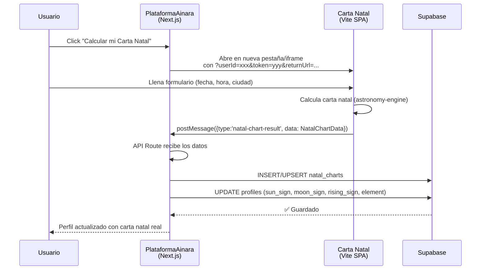

# Integración Carta Natal → Perfil de Usuario (PlataformaAinara)

## Resumen Ejecutivo

**Objetivo**: Permitir que los usuarios de la plataforma educativa calculen su carta natal real desde el proyecto separado (`carta-natal` en Vercel) y que esos datos se guarden y persistan en su perfil de Supabase, reemplazando los datos astrológicos ficticios actuales.

**Veredicto: ✅ Es viable y seguro**. La integración se puede lograr sin romper ninguno de los dos proyectos. Ambos siguen desplegados por separado. Los cambios son aditivos (no se modifica lógica existente, se extiende).

---

## Análisis del Estado Actual

### Carta Natal (Vite + React SPA)
| Aspecto | Estado |
|---------|--------|
| **Stack** | React 19 + Vite 8 + Tailwind v4 |
| **Cálculos** | `astronomy-engine` local + AstroAPI.cloud (fallback) |
| **AI** | Gemini 3.5 Flash + OpenRouter (fallback) |
| **Persistencia** | ⚠️ **NINGUNA** — todo efímero en estado React |
| **Deploy** | Vercel (SPA independiente) |

### PlataformaAinara (Next.js + Supabase)
| Aspecto | Estado |
|---------|--------|
| **Stack** | Next.js 15 + Supabase + Tailwind v4 |
| **Perfil** | Tabla `profiles` con campos `birth_date`, `birth_time`, `birth_city` |
| **Astrología actual** | Función `getSunSign()` — lookup por fecha, sin cálculos reales |
| **Sección "Diseño Cósmico"** | Muestra solo signo solar basado en fecha de nacimiento |
| **Deploy** | Vercel (proyecto separado) |

---

## Arquitectura de Integración



---

## User Review Required

> [!IMPORTANT]
> **Decisión de UX: ¿Iframe embebido o nueva pestaña?**
> 
> Hay dos opciones para cómo el usuario interactúa con la carta natal:
> 
> **Opción A — Iframe embebido (Recomendada)**: La carta natal se abre dentro de un modal/drawer en la plataforma. El usuario nunca sale de la página. La comunicación se hace por `postMessage`. Es la experiencia más fluida.
> 
> **Opción B — Nueva pestaña con redirect**: Se abre en una nueva pestaña. Al terminar, la app de carta natal redirige de vuelta con los datos como query params codificados, o usa `postMessage` al `window.opener`.
> 
> Ambas son viables. La Opción A es más elegante y la que planeo implementar, pero necesito tu aprobación.

> [!WARNING]
> **Exposición de API Keys en carta-natal**
> 
> Actualmente, las claves de Gemini, OpenRouter y AstroAPI están expuestas en el cliente (prefijo `VITE_`). Esto es un riesgo de seguridad pero ya funciona así en producción. La integración NO empeora esta situación. Si quieres, puedo crear un proxy server-side en la plataforma para proteger estas keys, pero eso sería un cambio separado.

> [!IMPORTANT]
> **¿Quieres que la interpretación AI también se guarde?**
> 
> Actualmente la carta natal calcula posiciones planetarias Y genera una interpretación con IA. Puedo:
> - **A)** Guardar solo los datos numéricos (posiciones, casas, aspectos) — más ligero
> - **B)** Guardar datos + interpretación AI completa — más rico pero más storage
> 
> Recomiendo la opción A (solo datos) y que la interpretación se genere on-demand cuando el usuario la quiera ver, ahorrando storage.

---

## Open Questions

> [!IMPORTANT]
> **¿La carta natal debe ser recalculable?**
> Una vez que el usuario calcula su carta, ¿puede volver a calcularla (por ejemplo si se equivocó de hora)? Mi plan es que sí, haciendo un UPSERT que reemplace los datos anteriores.

> [!NOTE]
> **Visibilidad de la carta natal en perfiles públicos**
> Actualmente los campos `birth_date`, `birth_time`, `birth_city` ya se muestran en el perfil público. ¿Quieres que la carta natal completa (planetas, casas, ascendente, etc.) también sea visible en el perfil público de otros usuarios, o solo un resumen (Sol, Luna, Ascendente)?

---

## Proposed Changes

### Componente 1: Base de Datos (Supabase)

Se necesita una nueva tabla para almacenar la carta natal completa, y campos adicionales en `profiles`.

#### [NEW] Migration: `migrations/0011_natal_charts.sql`

```sql
-- Nueva tabla para almacenar cartas natales completas
CREATE TABLE IF NOT EXISTS public.natal_charts (
  id UUID PRIMARY KEY DEFAULT uuid_generate_v4(),
  user_id UUID REFERENCES public.profiles(id) ON DELETE CASCADE UNIQUE,
  
  -- Datos de nacimiento usados para el cálculo
  birth_date TEXT NOT NULL,
  birth_time TEXT NOT NULL,
  birth_city TEXT NOT NULL,
  birth_country TEXT,
  latitude DOUBLE PRECISION NOT NULL,
  longitude DOUBLE PRECISION NOT NULL,
  timezone TEXT,
  
  -- Posiciones planetarias (JSON array de PlanetPosition[])
  planets JSONB NOT NULL DEFAULT '[]'::jsonb,
  
  -- Casas (JSON array de HouseCusp[])
  houses JSONB NOT NULL DEFAULT '[]'::jsonb,
  
  -- Aspectos (JSON array de Aspect[])
  aspects JSONB NOT NULL DEFAULT '[]'::jsonb,
  
  -- Ángulos principales
  ascendant JSONB,    -- AnglePoint
  midheaven JSONB,    -- AnglePoint
  
  -- Metadata
  calculated_at TIMESTAMPTZ DEFAULT NOW(),
  created_at TIMESTAMPTZ DEFAULT NOW(),
  updated_at TIMESTAMPTZ DEFAULT NOW()
);

-- RLS: Todos pueden leer (perfiles son públicos), solo el dueño puede insertar/actualizar
ALTER TABLE public.natal_charts ENABLE ROW LEVEL SECURITY;

CREATE POLICY "Natal charts viewable by everyone" 
  ON public.natal_charts FOR SELECT USING (true);

CREATE POLICY "Users insert own natal chart" 
  ON public.natal_charts FOR INSERT WITH CHECK (auth.uid() = user_id);

CREATE POLICY "Users update own natal chart" 
  ON public.natal_charts FOR UPDATE USING (auth.uid() = user_id);

-- Agregar campos derivados a profiles para acceso rápido
DO $$ 
BEGIN
  IF NOT EXISTS (SELECT 1 FROM information_schema.columns 
    WHERE table_name='profiles' AND column_name='sun_sign') THEN 
    ALTER TABLE public.profiles ADD COLUMN sun_sign TEXT;
  END IF;
  IF NOT EXISTS (SELECT 1 FROM information_schema.columns 
    WHERE table_name='profiles' AND column_name='moon_sign') THEN 
    ALTER TABLE public.profiles ADD COLUMN moon_sign TEXT;
  END IF;
  IF NOT EXISTS (SELECT 1 FROM information_schema.columns 
    WHERE table_name='profiles' AND column_name='rising_sign') THEN 
    ALTER TABLE public.profiles ADD COLUMN rising_sign TEXT;
  END IF;
  IF NOT EXISTS (SELECT 1 FROM information_schema.columns 
    WHERE table_name='profiles' AND column_name='natal_chart_id') THEN 
    ALTER TABLE public.profiles ADD COLUMN natal_chart_id UUID REFERENCES public.natal_charts(id);
  END IF;
END $$;

-- Índice para búsquedas rápidas
CREATE INDEX IF NOT EXISTS idx_natal_charts_user_id ON public.natal_charts(user_id);
```

**Rationale**: Usar JSONB para planetas, casas y aspectos permite guardar la estructura completa sin crear decenas de tablas relacionales. Es la mejor opción porque:
- Los datos se leen/escriben como un bloque completo
- No hay queries parciales sobre posiciones individuales
- JSONB es indexable si algún día se necesita

---

### Componente 2: API Routes (PlataformaAinara — Next.js)

#### [NEW] [app/api/natal-chart/route.ts](file:///c:/Users/TP412/Dropbox/PC/Documents/PlataformaAinara/app/api/natal-chart/route.ts)

Endpoint para guardar la carta natal del usuario autenticado.

```typescript
// POST /api/natal-chart — Guarda/actualiza carta natal
// GET  /api/natal-chart — Recupera carta natal del usuario actual
// GET  /api/natal-chart?userId=xxx — Recupera carta natal de otro usuario
```

- **POST**: Recibe `NatalChartData` del proyecto carta-natal, la guarda en `natal_charts`, y actualiza `profiles.sun_sign`, `profiles.moon_sign`, `profiles.rising_sign` con los datos reales del Sol, Luna y Ascendente
- **GET**: Devuelve la carta natal del usuario actual o de otro usuario (lectura pública)
- Protegido por autenticación Supabase (cookies)

---

### Componente 3: Modificaciones al Proyecto Carta Natal (Vite SPA)

#### [MODIFY] [App.tsx](file:///c:/Users/TP412/Dropbox/PC/Documents/PlataformaAinara/carta-natal/carta-natal/src/App.tsx)

Agregar lógica para:
1. Detectar si viene desde la plataforma (params `?embedded=true&origin=https://plataforma.url`)
2. Tras calcular la carta natal, enviar los datos al `window.parent` via `postMessage`
3. Mostrar un botón "Guardar en mi perfil" cuando viene desde la plataforma

```diff
+ // Detectar modo integrado
+ const urlParams = new URLSearchParams(window.location.search);
+ const isEmbedded = urlParams.get('embedded') === 'true';
+ const parentOrigin = urlParams.get('origin') || '';
+
+ // Tras calcular, enviar datos al padre
+ function sendChartToParent(chartData: NatalChartData) {
+   if (isEmbedded && parentOrigin) {
+     window.parent.postMessage({
+       type: 'natal-chart-calculated',
+       data: chartData
+     }, parentOrigin);
+   }
+ }
```

**Cambios mínimos**: Solo se agrega la capacidad de comunicar resultados. El app sigue funcionando exactamente igual cuando se usa de forma independiente.

#### [MODIFY] [index.css](file:///c:/Users/TP412/Dropbox/PC/Documents/PlataformaAinara/carta-natal/carta-natal/src/index.css)

Agregar estilos para modo embebido (sin padding extra, adaptarse al contenedor padre).

---

### Componente 4: Perfil del Usuario (PlataformaAinara)

#### [MODIFY] [profile/page.tsx](file:///c:/Users/TP412/Dropbox/PC/Documents/PlataformaAinara/app/%28platform%29/profile/page.tsx)

Cambios en la sección "Diseño Cósmico" (líneas 258-280):

1. **Reemplazar** la sección actual (que usa `getSunSign()` con lookup simple) por una versión que muestra datos reales de la tabla `natal_charts`
2. **Agregar botón** "Calcular mi Carta Natal" que abre el modal con iframe
3. **Mostrar resumen expandido**: Sol ☀️, Luna 🌙, Ascendente ⬆️, Medio Cielo, y lista de planetas si el usuario tiene carta calculada
4. **Mantener fallback**: Si no tiene carta natal, seguir mostrando el signo solar simple como ahora

```diff
- const astro = userData.birth_date ? getSunSign(userData.birth_date) : null
- const sunSign = astro?.sign || ""
- const signSymbol = astro?.symbol || ""
+ // Fetch natal chart data
+ const { data: natalChart } = await supabase
+   .from("natal_charts")
+   .select("*")
+   .eq("user_id", user.id)
+   .maybeSingle()
+
+ // Fallback a lookup simple si no tiene carta natal
+ const astro = userData.birth_date ? getSunSign(userData.birth_date) : null
+ const sunSign = natalChart 
+   ? natalChart.planets?.find(p => p.name === 'Sol')?.sign 
+   : astro?.sign || ""
```

#### [NEW] [components/profile/NatalChartSection.tsx](file:///c:/Users/TP412/Dropbox/PC/Documents/PlataformaAinara/components/profile/NatalChartSection.tsx)

Nuevo componente client que:
- Muestra el resumen de la carta natal (Sol, Luna, Ascendente, Elemento dominante)
- Tiene un botón "Ver Carta Natal Completa" que expande los detalles
- Tiene un botón "Calcular mi Carta Natal" / "Recalcular" que abre el iframe modal
- Maneja la comunicación `postMessage` con la app carta-natal embebida

#### [NEW] [components/profile/NatalChartModal.tsx](file:///c:/Users/TP412/Dropbox/PC/Documents/PlataformaAinara/components/profile/NatalChartModal.tsx)

Modal con Dialog (Radix) que embebe la app carta-natal en un iframe:
- Escucha `postMessage` del iframe para recibir los datos calculados
- Llama al API route `POST /api/natal-chart` para guardar
- Cierra el modal y revalida la página tras guardar exitosamente
- Muestra estados de loading/success/error

#### [MODIFY] [profile/actions.ts](file:///c:/Users/TP412/Dropbox/PC/Documents/PlataformaAinara/app/%28platform%29/profile/actions.ts)

Agregar server action `saveNatalChart(data)` que:
- Valida los datos recibidos con Zod
- Hace UPSERT en `natal_charts`
- Actualiza `profiles.sun_sign`, `profiles.moon_sign`, `profiles.rising_sign`
- Revalida paths `/profile`, `/u/[userId]`

---

### Componente 5: Perfil Público

#### [MODIFY] [u/[userId]/page.tsx](file:///c:/Users/TP412/Dropbox/PC/Documents/PlataformaAinara/app/%28platform%29/u/%5BuserId%5D/page.tsx)

La sección "Diseño Cósmico" (líneas 172-196) se actualiza para:
1. Hacer fetch de `natal_charts` del usuario visitado
2. Si tiene carta natal real, mostrar: Sol, Luna, Ascendente con grados
3. Opcionalmente mostrar lista expandible de planetas y casas
4. Si no tiene carta natal, mantener el comportamiento actual (signo solar simple)

---

### Componente 6: Tipos TypeScript

#### [MODIFY] [types/index.ts](file:///c:/Users/TP412/Dropbox/PC/Documents/PlataformaAinara/types/index.ts)

Agregar tipos compartidos para la carta natal (alineados con los tipos del proyecto carta-natal):

```typescript
// Tipos de Carta Natal (compatibles con el proyecto carta-natal)
export type ZodiacSign = 
  'Aries' | 'Tauro' | 'Géminis' | 'Cáncer' | 'Leo' | 'Virgo' | 
  'Libra' | 'Escorpio' | 'Sagitario' | 'Capricornio' | 'Acuario' | 'Piscis'

export interface PlanetPosition {
  name: string
  sign: ZodiacSign
  degree: number
  minutes: number
  absoluteDegree: number
  house: number
  retrograde: boolean
}

export interface NatalChartRecord {
  id: string
  user_id: string
  birth_date: string
  birth_time: string
  birth_city: string
  birth_country: string | null
  latitude: number
  longitude: number
  timezone: string | null
  planets: PlanetPosition[]
  houses: HouseCusp[]
  aspects: Aspect[]
  ascendant: AnglePoint | null
  midheaven: AnglePoint | null
  calculated_at: string
}
```

---

## Resumen de Archivos

| Acción | Archivo | Descripción |
|--------|---------|-------------|
| 🆕 NEW | `migrations/0011_natal_charts.sql` | Tabla `natal_charts` + campos en `profiles` |
| 🆕 NEW | `app/api/natal-chart/route.ts` | API para guardar/leer carta natal |
| 🆕 NEW | `components/profile/NatalChartSection.tsx` | Sección de carta natal en perfil |
| 🆕 NEW | `components/profile/NatalChartModal.tsx` | Modal iframe para calcular carta |
| ✏️ MODIFY | `app/(platform)/profile/page.tsx` | Integrar NatalChartSection |
| ✏️ MODIFY | `app/(platform)/profile/actions.ts` | Server action para guardar carta |
| ✏️ MODIFY | `app/(platform)/u/[userId]/page.tsx` | Mostrar carta en perfil público |
| ✏️ MODIFY | `types/index.ts` | Tipos de carta natal |
| ✏️ MODIFY | `carta-natal/src/App.tsx` | Modo embebido + postMessage |
| ✏️ MODIFY | `carta-natal/src/index.css` | Estilos modo embebido |

---

## Verificación

### Automated Tests
1. **Build de la plataforma**: `npm run build` — verificar que compila sin errores
2. **Build de carta-natal**: `cd carta-natal/carta-natal && pnpm build` — verificar que compila
3. **Migración SQL**: Ejecutar en Supabase SQL Editor y verificar que la tabla se crea correctamente

### Manual Verification
1. Abrir perfil → click "Calcular Carta Natal" → llenar formulario → verificar que se guarda
2. Refrescar perfil → verificar que los datos persisten (Sol, Luna, Ascendente reales)
3. Visitar perfil público de ese usuario → verificar que muestra la carta natal
4. Recalcular → verificar que se actualiza (UPSERT)
5. Verificar que la app carta-natal independiente sigue funcionando normalmente en su URL propia

---

## Riesgos y Mitigación

| Riesgo | Probabilidad | Mitigación |
|--------|-------------|------------|
| CORS al embeber iframe | Media | Configurar `vercel.json` de carta-natal para permitir ser embebido desde el dominio de la plataforma |
| Datos de carta natal inválidos | Baja | Validación con Zod en el API route antes de guardar |
| Romper la app carta-natal | Muy baja | Los cambios son aditivos (detectar `?embedded=true`), el flujo normal no se toca |
| Romper el perfil | Muy baja | La sección actual se mantiene como fallback, solo se muestra el upgrade si hay datos |
| postMessage interceptado | Baja | Validar `origin` del mensaje en ambos lados |
